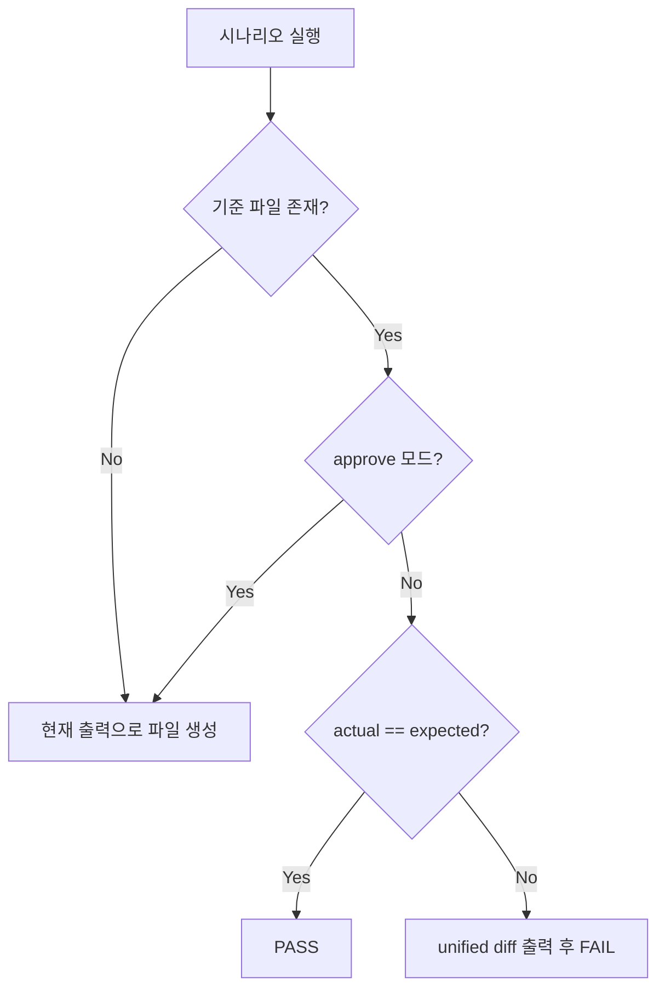

# Golden Master (Approval) 패턴 설계 — GM-1

| 항목 | 내용 |
|---|---|
| **문서 ID** | GM-1 |
| **대상** | Magic Square Solver 회귀 테스트 |
| **기준 파일** | `tests/golden_master_expected.txt` |
| **캡처 방식** | `ResolveUseCase.execute()` → Result DTO serialize |
| **생성 스크립트** | `scripts/generate_golden_master.py` |
| **pytest 진입점 (GM-2)** | `tests/boundary/test_golden_master_magic_square.py` |
| **pytest 마커** | `@pytest.mark.golden_master` |

---

## 1. 목적

Solver·검증 로직이 GREEN으로 진화할 때 **출력 계약이 의도치 않게 바뀌지 않음**을 한 파일로 고정한다.  
기준 파일은 버전 관리에 포함하며, 변경은 **approve** 절차를 통해서만 반영한다.

---

## 2. 시나리오 (PRD §16.4)

| Section ID | 입력 출처 | 기대 결과 |
|---|---|---|
| `normal_success` | D-01 small-first | `Output: [1,1,16,4,4,1]` (실출력 baseline) |
| `reverse_success` | D-02 reverse | `Output: [3,3,6,4,4,1]` |
| `invalid_blank_count` | 빈칸 3개 (D-04) | `Error: INVALID_BLANK_COUNT` |
| `duplicate_number` | G1 + 중복 2 (D-05) | `Error: DUPLICATE_NON_ZERO` |
| `no_valid_solution` | G3 placeholder (D-06) | `Error: NO_VALID_SOLUTION` |

시나리오 정의: `tests/helpers/golden_scenarios.py`

---

## 3. 기준 파일 구조

```
[section_id]
Input:
<4 rows, space-separated cells>
Output:
[r,c,n,r,c,n]
```

또는 실패 시:

```
[section_id]
Input:
...
Error:
ERROR_CODE
```

- 좌표·값은 **1-index**, 성공 벡터 길이 **6**
- `Output` 값은 공백 없는 compact 형식: `[3,3,6,4,4,1]`

---

## 4. GM-2 테스트 케이스

| Test ID | Section | 검증 |
|---|---|---|
| GM-TC-01 | `normal_success` | golden section + `int[6]`·1-index·row-major·조합 성공 |
| GM-TC-02 | `reverse_success` | golden section + reverse fallback (attempt 1 실패, 2 성공) |
| GM-TC-03 | `invalid_blank_count` | golden section + `INVALID_BLANK_COUNT` Error Contract |
| GM-TC-04 | `duplicate_number` | golden section + `DUPLICATE_NON_ZERO` Error Contract |
| GM-TC-05 | `no_valid_solution` | golden section + `NO_VALID_SOLUTION` (NO_VALID_MAGIC_SQUARE) |

실행:

```bash
pytest -m golden_master -v
pytest -m golden_master --golden-approve -v
```

불일치 시 `difflib.unified_diff`로 `--- expected` / `+++ actual` / `@@` hunk이 AssertionError에 포함된다.

---

## 5. Approve 패턴



### 5.1 기준 파일 없음

- pytest 또는 생성 스크립트가 **현재 Solver 출력**으로 `tests/golden_master_expected.txt`를 자동 생성한다.

### 5.2 기준 파일 있음 (일반 모드)

- `build_golden_document()`로 전체 actual 문서를 조립한다.
- committed baseline과 **문자 단위** 비교한다.
- 불일치 시 `difflib.unified_diff` 결과를 AssertionError/pytest.fail에 포함한다.

### 5.3 Approve 모드

의도된 출력 변경 시 baseline을 갱신한다.

```bash
# pytest
pytest -m golden_master --golden-approve

# standalone script (baseline refresh)
python scripts/generate_golden_master.py

# compare only (CI / local gate)
python scripts/generate_golden_master.py --check
```

---

## 6. 캡처 파이프라인

```
GoldenScenario.grid
    → ResolveUseCase.execute(grid)
        → FailureResponse  → Error:\n{code}
        → list[int]        → Output:\n[...]
        → NotImplementedError → Error:\nNOT_IMPLEMENTED
```

- ECB 준수: Boundary GUI 없이 **Control 진입점**만 사용
- stdout 캡처는 사용하지 않음 (GUI/CLI 미존재)

핵심 모듈: `tests/helpers/golden_master.py`

| 함수 | 역할 |
|---|---|
| `capture_resolve_output` | 단일 시나리오 DTO serialize |
| `build_golden_document` | 전체 기준 문서 조립 |
| `assert_golden_master` | 전체 문서 approve / compare |
| `assert_golden_section` | 시나리오 단위 approve / compare |
| `assert_scenario_output_contract` | int[6]·row-major·reverse·Error Contract |
| `unified_diff` | 불일치 diff 생성 |

---

## 7. 운영 절차

### 7.1 최초 baseline 생성 (현재 출력 기반)

```bash
python scripts/generate_golden_master.py
git add tests/golden_master_expected.txt
```

### 7.2 회귀 검증 (CI / 로컬)

```bash
pytest -m golden_master -v
python scripts/generate_golden_master.py --check
```

### 7.3 계약 변경 후 재승인

1. Solver/검증 구현 변경
2. `pytest ... --golden-approve` 또는 `python scripts/generate_golden_master.py`
3. diff 검토 후 commit

---

## 8. 실행 결과 예시 (GM-2 GREEN)

```text
$ python -m pytest -m golden_master -v
tests/boundary/test_golden_master_magic_square.py::test_gm_tc_matches_golden_baseline[GM-TC-01] PASSED
tests/boundary/test_golden_master_magic_square.py::test_gm_tc_matches_golden_baseline[GM-TC-02] PASSED
tests/boundary/test_golden_master_magic_square.py::test_gm_tc_matches_golden_baseline[GM-TC-03] PASSED
tests/boundary/test_golden_master_magic_square.py::test_gm_tc_matches_golden_baseline[GM-TC-04] PASSED
tests/boundary/test_golden_master_magic_square.py::test_gm_tc_matches_golden_baseline[GM-TC-05] PASSED
tests/boundary/test_golden_master_magic_square.py::test_golden_master_document_matches_baseline PASSED
============================== 6 passed ==============================
```

---

## 9. 현재 baseline (Solver 실출력, GM-1 GREEN)

| 시나리오 | committed baseline |
|---|---|
| `normal_success` | `Output: [1,1,16,4,4,1]` |
| `reverse_success` | `Output: [3,3,6,4,4,1]` |
| `invalid_blank_count` | `Error: INVALID_BLANK_COUNT` |
| `duplicate_number` | `Error: DUPLICATE_NON_ZERO` |
| `no_valid_solution` | `Error: NO_VALID_SOLUTION` |

`pytest -m golden_master` 및 `python scripts/generate_golden_master.py --check`가 PASS한다.  
출력 변경 시 `pytest --golden-approve` 또는 `python scripts/generate_golden_master.py`로 baseline을 재생성한 뒤 diff를 검토해 commit한다.

---

## 10. 추적성

| 요구 | 구현 |
|---|---|
| GM-1 기준 파일 | `tests/golden_master_expected.txt` |
| GM-2 테스트 | `tests/boundary/test_golden_master_magic_square.py` |
| approve 패턴 | `assert_golden_master`, `assert_golden_section`, `--golden-approve` |
| 생성 스크립트 | `scripts/generate_golden_master.py` |
| 시나리오 레지스트리 | `tests/helpers/golden_scenarios.py` |
